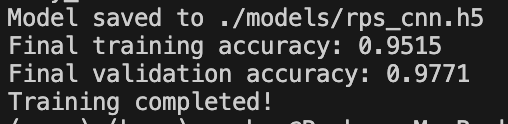

# 🪨📄✂️ AI Rock Paper Scissors Game

An interactive Rock Paper Scissors game that uses computer vision and deep learning to detect hand gestures in real-time. Play against an AI opponent using your webcam!



## 🎮 Features

- **Real-time Hand Gesture Recognition**: Uses a custom-trained CNN model to detect rock, paper, and scissors gestures
- **Live Camera Feed**: Play using your webcam with real-time gesture detection
- **AI Opponent**: Compete against a computer opponent with random moves
- **Score Tracking**: Keep track of wins and losses during gameplay
- **Confidence Scoring**: See how confident the AI is about detecting your gesture
- **Modern UI**: Clean, visual interface with overlay graphics

## 🚀 Getting Started

### Prerequisites

- Python 3.7 or higher
- Webcam/Camera
- Operating System: Windows, macOS, or Linux

### Installation

1. **Clone the repository**
   ```bash
   git clone https://github.com/yourusername/rockpaperscissors.git
   cd rockpaperscissors
   ```

2. **Install dependencies**
   ```bash
   pip install -r requirements.txt
   ```

3. **Verify the model file exists**
   Make sure `models/rps_cnn.h5` is present. If not, you'll need to train the model first (see [Training Your Own Model](#training-your-own-model)).

### Quick Start

1. **Run the game**
   ```bash
   python game.py
   ```

2. **Game Controls**
   - Press `s` to start a new round
   - Press `q` or `ESC` to quit the game
   - Show your hand gesture (rock, paper, or scissors) to the camera
   - Wait for the 3-second countdown, then make your move!

## 🎯 How to Play

1. Position yourself in front of your camera
2. Press `s` to start a round
3. When the countdown begins, get ready to show your gesture
4. After the 3-second countdown, make your rock, paper, or scissors gesture
5. The AI will make its move and determine the winner
6. Scores are tracked automatically

### Game Rules
- ✂️ Scissors beats 📄 Paper
- 📄 Paper beats 🪨 Rock  
- 🪨 Rock beats ✂️ Scissors

## 🧠 Model Architecture

The game uses a Convolutional Neural Network (CNN) with the following architecture:

- **Input Layer**: 128x128x3 (RGB images)
- **Conv2D Layers**: 32, 64, 128 filters with ReLU activation
- **MaxPooling2D**: After each convolutional layer
- **Dense Layers**: 128 neurons + 3 output classes
- **Activation**: Softmax for classification

### Model Performance
- **Training Accuracy**: Achieved during model training
- **Validation Accuracy**: Monitored to prevent overfitting
- **Real-time Inference**: Optimized for live camera feed

## 📁 Project Structure

```
rockpaperscissors/
├── game.py                 # Main game loop and UI
├── detect.py              # Hand gesture detection functions
├── model.py               # CNN model definition and training
├── requirements.txt       # Python dependencies
├── model_accuracy.png     # Model performance visualization
├── models/
│   └── rps_cnn.h5        # Trained CNN model
├── data/
│   ├── train/            # Training dataset
│   │   ├── paper/        # Paper gesture images
│   │   ├── rock/         # Rock gesture images
│   │   └── scissors/     # Scissors gesture images
│   └── val/              # Validation dataset
│       ├── paper/
│       ├── rock/
│       └── scissors/
└── Resources/
    ├── BG.png            # Game background
    ├── 1.png             # Rock gesture icon
    ├── 2.png             # Paper gesture icon
    └── 3.png             # Scissors gesture icon
```

## 🔧 Training Your Own Model

If you want to train the model from scratch or with your own dataset:

1. **Prepare your dataset**
   - Add images to `data/train/paper/`, `data/train/rock/`, `data/train/scissors/`
   - Images should be clear shots of the respective hand gestures
   - Recommended: 100-500 images per class for good performance

2. **Train the model**
   ```bash
   python model.py
   ```

3. **Monitor training**
   - The model will train for up to 15 epochs
   - Early stopping prevents overfitting
   - Model will be saved to `models/rps_cnn.h5`

## 🛠️ Customization

### Adjusting Camera Settings
In `game.py`, modify these lines to change camera properties:
```python
cap = cv2.VideoCapture(1)  # Change camera index if needed
cap.set(3, 640)           # Width
cap.set(4, 480)           # Height
```

### Modifying Detection Sensitivity
In `detect.py`, you can adjust confidence thresholds for gesture detection.

### Changing Game Timer
In `game.py`, modify the countdown timer:
```python
if timer > 3:  # Change from 3 seconds to desired duration
```

## 🐛 Troubleshooting

### Common Issues

1. **Camera not detected**
   - Try changing the camera index in `game.py`: `cv2.VideoCapture(0)` or `cv2.VideoCapture(1)`
   - Ensure your camera is not being used by another application

2. **Model file not found**
   - Make sure `models/rps_cnn.h5` exists
   - If missing, run `python model.py` to train a new model

3. **Poor gesture detection**
   - Ensure good lighting conditions
   - Position your hand clearly in the camera frame
   - Consider retraining the model with more diverse data

4. **Dependencies issues**
   - Update pip: `pip install --upgrade pip`
   - Install specific versions: `pip install tensorflow==2.10.0`

## 📋 Requirements

- `tensorflow>=2.10.0` - Deep learning framework
- `opencv-python>=4.7.0` - Computer vision library
- `numpy>=1.21.0` - Numerical computing
- `Pillow>=9.0.0` - Image processing
- `scikit-learn>=1.1.0` - Machine learning utilities
- `cvzone` - Computer vision utilities

## 🤝 Contributing

Contributions are welcome! Here are some ways you can help:

1. **Improve the model**: Add more training data or experiment with different architectures
2. **Enhance the UI**: Create better graphics or add sound effects
3. **Add features**: Implement multiplayer mode, statistics tracking, or different game modes
4. **Bug fixes**: Report and fix any issues you encounter

### Development Setup

1. Fork the repository
2. Create a feature branch: `git checkout -b feature-name`
3. Make your changes and test thoroughly
4. Submit a pull request with a clear description

## 📝 License

This project is open source and available under the [MIT License](LICENSE).

## 🎉 Acknowledgments

- Dataset inspiration from various hand gesture recognition projects
- OpenCV community for excellent computer vision tools
- TensorFlow team for the deep learning framework

## 📞 Contact

- **Author**: Your Name
- **Email**: your.email@example.com
- **GitHub**: [@yourusername](https://github.com/yourusername)
- **Project Link**: [https://github.com/yourusername/rockpaperscissors](https://github.com/yourusername/rockpaperscissors)

---

⭐ **Star this repository if you found it helpful!** ⭐

*Have fun playing Rock Paper Scissors with AI! 🤖*
